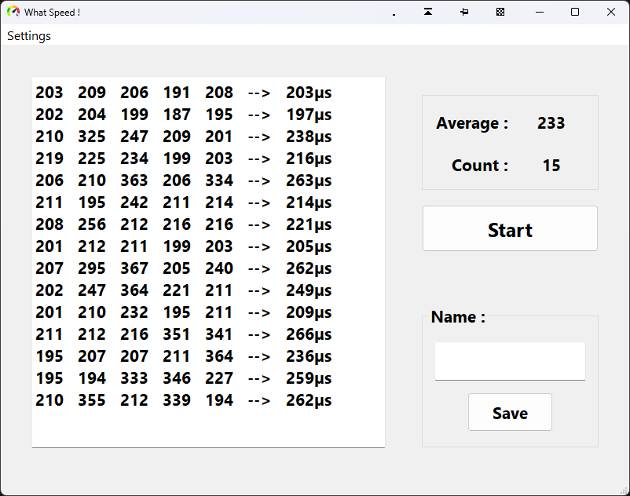
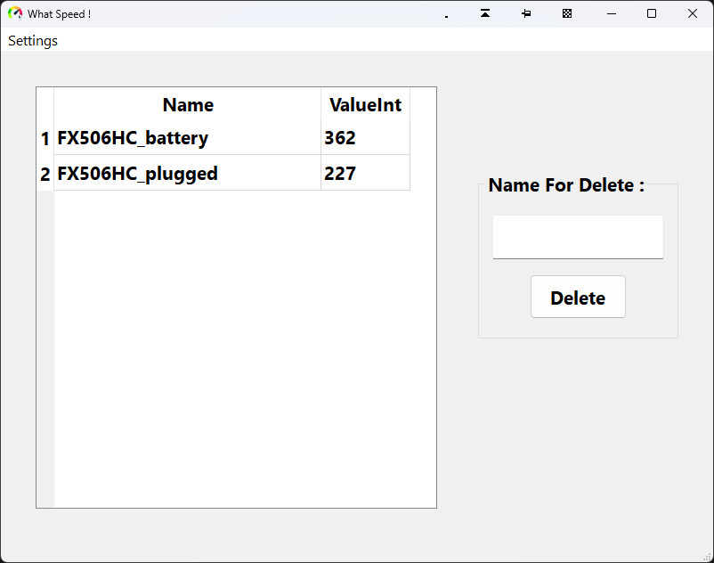

# What-Speed

This project is a program to test the speed of the computer in the execution of a process.

This program works by giving a process to the computer and recording its execution time in microseconds. This number is obtained by repeating a process **five** times. And for each click on the **Start** button, this operation is repeated and finally the average of all these tests is displayed in the **Average** section.

> [!WARNING]\
> This project can only run on **64-bit** Windows .

---

1. Show running time every time
2. Save in Database
3. Display the records in the table

---
 

 

